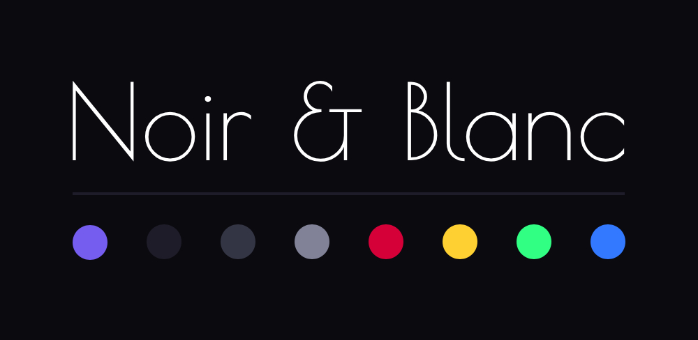

# Noir & Blanc Theme for Zed



## Overview

Noir & Blanc is a minimalist theme for Zed with a focus on readability and careful color usage. The theme comes in two variants:

- **Blanc**: A clean light theme with dark text on white background
- **Noir**: A sleek dark theme with white text on black background

Both themes use a signature purple accent color to highlight important elements while maintaining a monochromatic base.

## Features

- Clean, distraction-free interface
- Strong contrast for improved readability
- Thoughtful syntax highlighting
- Consistent color usage across UI elements
- Beautiful purple accents (#755DEF) that tie the experience together

## Installation

To install the Noir & Blanc theme:

1. Navigate to your Zed themes directory:

   ```
   ~/.config/zed/themes/
   ```

2. Place the `noir-and-blanc.json` file in this directory.

3. Restart Zed or reload themes.

4. Select either `Blanc` or `Noir` from the theme selector.

## Additional Customization

You can customize the theme by adding additional overrides to the `experimental.theme_overrides` object. Zed will live-reload when you save your settings, making it easy to experiment with different color combinations.

For a full list of customizable properties, check the [Zed themes documentation](https://zed.dev/docs/themes) or refer to the theme file structure.
